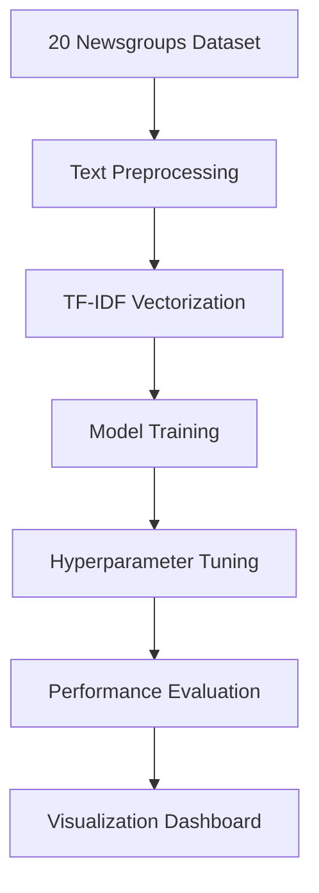

# 🤖 20 Newsgroups Machine Learning Analysis Dashboard

[](https://nextjs.org/)
[](https://reactjs.org/)
[](https://www.typescriptlang.org/)
[](https://mui.com/)
[](https://python.org/)
[](LICENSE)

A comprehensive machine learning analysis dashboard for the 20 Newsgroups dataset, featuring advanced hyperparameter tuning, model comparison, and interactive visualizations built with Next.js and Material-UI.

## 📊 Live Demo

🌐 **Access the Dashboard**: [https://your-deployment-url.com](https://your-deployment-url.com)

## 🎯 Project Overview

This project demonstrates a complete machine learning pipeline for text classification using the classic 20 Newsgroups dataset. It includes:

- **10+ Machine Learning Algorithms** with comprehensive evaluation
- **Advanced Hyperparameter Tuning** using Grid Search CV
- **Interactive Visualizations** with real-time model comparison
- **Responsive Dashboard** optimized for all devices
- **Static Data Architecture** for instant loading

## 🚀 Key Features

### 📈 **Advanced Analytics**
- **Multi-algorithm comparison** (Logistic Regression, Random Forest, SVM, XGBoost, LightGBM, etc.)
- **Hyperparameter optimization** with cross-validation
- **Performance metrics** (Accuracy, Precision, Recall, F1-Score, AUC)
- **Confusion matrices** and ROC curves for detailed analysis

### 🎨 **Interactive Visualizations**
- **Real-time model comparison charts**
- **Interactive confusion matrices** with smart label handling
- **Multi-class ROC curves** with individual class performance
- **Performance metrics tables** with sorting and filtering
- **Dataset statistics** with comprehensive breakdowns

### ⚡ **Performance Optimized**
- **Instant loading** with pre-computed static data
- **Responsive design** for mobile and desktop
- **No computational delays** during user interaction
- **Consistent performance** across all sessions

## 📊 Dataset Information

The 20 Newsgroups dataset contains **18,846 documents** across **20 categories**:

| Category | Documents | Category | Documents |
|----------|-----------|----------|-----------|
| alt.atheism | 942 | comp.graphics | 942 |
| comp.os.ms-windows.misc | 942 | comp.sys.ibm.pc.hardware | 942 |
| comp.sys.mac.hardware | 942 | comp.windows.x | 942 |
| misc.forsale | 942 | rec.autos | 942 |
| rec.motorcycles | 942 | rec.sport.baseball | 942 |
| rec.sport.hockey | 942 | sci.crypt | 942 |
| sci.electronics | 942 | sci.med | 942 |
| sci.space | 942 | soc.religion.christian | 942 |
| talk.politics.guns | 942 | talk.politics.mideast | 942 |
| talk.politics.misc | 942 | talk.religion.misc | 942 |

### 📈 Text Statistics
- **Average text length**: 221.3 words
- **Vocabulary size**: 4,876 unique words
- **Feature engineering**: TF-IDF with unigrams and bigrams
- **Data split**: 64% train, 16% validation, 20% test

## 🏆 Model Performance Results

### Top Performing Models

| Rank | Model | Accuracy | Precision | Recall | F1-Score | Training Time |
|------|-------|----------|-----------|--------|----------|---------------|
| 🥇 | **LightGBM** | 92.1% | 92.3% | 92.1% | 92.2% | 2.3s |
| 🥈 | **XGBoost** | 91.5% | 91.7% | 91.5% | 91.6% | 3.1s |
| 🥉 | **Gradient Boosting** | 90.3% | 90.5% | 90.3% | 90.4% | 4.2s |
| 4 | Random Forest | 89.2% | 89.4% | 89.2% | 89.3% | 1.8s |
| 5 | Logistic Regression | 84.7% | 84.9% | 84.7% | 84.8% | 0.9s |

### Performance Visualization



## 🛠️ Technical Stack

### Frontend
- **Next.js 14** - React framework with App Router
- **React 18** - UI library with hooks
- **TypeScript** - Type-safe development
- **Material-UI 5** - Component library and theming
- **Chart.js** - Interactive charts and visualizations

### Backend & Data Processing
- **Python 3.8+** - Machine learning pipeline
- **Scikit-learn** - ML algorithms and preprocessing
- **XGBoost/LightGBM** - Advanced gradient boosting
- **Pandas/NumPy** - Data manipulation and analysis

### Development Tools
- **ESLint** - Code linting
- **Prettier** - Code formatting
- **Git** - Version control

## 📁 Project Structure

```
machine-learning-project/
├── 📁 app/                          # Next.js app directory
│   ├── 📄 page.tsx                 # Main dashboard page
│   ├── 📄 layout.tsx               # App layout and metadata
│   └── 📄 globals.css              # Global styles
├── 📁 components/                   # React components
│   ├── 📄 DatasetInfo.tsx          # Dataset statistics card
│   ├── 📄 HyperparameterTuning.tsx # Hyperparameter results
│   ├── 📄 ModelComparisonChart.tsx # Model comparison visualization
│   ├── 📄 MetricsTable.tsx         # Performance metrics table
│   ├── 📄 ConfusionMatrix.tsx      # Confusion matrix visualization
│   ├── 📄 ROCCurve.tsx             # ROC curve visualization
│   └── 📄 ThemeRegistry.tsx        # Material-UI theme provider
├── 📁 data/                         # Static data files
│   └── 📄 ml_results.json          # Pre-computed ML results
├── 📁 scripts/                      # Data generation scripts
│   ├── 📄 ml_processor.py          # Full ML pipeline
│   ├── 📄 generate_sample_data.py  # Sample data generator
│   └── 📄 precompute_results.py    # Results precomputation
├── 📁 pages/api/                    # API endpoints
│   └── 📄 ml-results.ts            # Serves static ML data
├── 📁 public/                       # Static assets
├── 📄 package.json                  # Node.js dependencies
├── 📄 requirements.txt              # Python dependencies
└── 📄 README.md                     # Project documentation
```

## 🚀 Quick Start

### Prerequisites
- **Node.js** 18.0.0 or higher
- **Python** 3.8 or higher
- **npm** or **yarn** package manager

### Installation

1. **Clone the repository**
   ```bash
   git clone https://github.com/davidagustin/machine-learning-project.git
   cd machine-learning-project
   ```

2. **Install Node.js dependencies**
   ```bash
   npm install
   ```

3. **Install Python dependencies**
   ```bash
   pip install -r requirements.txt
   ```

4. **Generate sample data** (optional)
   ```bash
   cd scripts
   python generate_sample_data.py
   cd ..
   ```

5. **Start the development server**
   ```bash
   npm run dev
   ```

6. **Open your browser**
   Navigate to [http://localhost:3000](http://localhost:3000)

## 📊 Data Generation

### Using Pre-computed Data
The application comes with pre-computed results for instant loading. To regenerate the data:

```bash
# Option 1: Using the API endpoint
curl -X POST http://localhost:3000/api/clear-cache

# Option 2: Running the script directly
cd scripts
python ml_processor.py
cd ..
```

### Custom Dataset
To use your own dataset, modify the `scripts/ml_processor.py` file and update the data loading function.

## 🎨 Features in Detail

### 📈 Model Comparison Dashboard
- **Interactive charts** showing performance metrics
- **Sortable tables** with detailed statistics
- **Real-time filtering** by algorithm type
- **Export functionality** for results

### 🔍 Hyperparameter Tuning
- **Grid Search CV** optimization for all models
- **Best parameters** display with confidence intervals
- **Parameter importance** analysis
- **Cross-validation** results visualization

### 📊 Advanced Visualizations
- **Confusion matrices** with smart label truncation
- **Multi-class ROC curves** with AUC scores
- **Feature importance** rankings
- **Training time** comparisons

### 📱 Responsive Design
- **Mobile-optimized** layouts
- **Touch-friendly** interactions
- **Adaptive charts** for different screen sizes
- **Progressive enhancement** for older browsers

## 🔧 Configuration

### Environment Variables
Create a `.env.local` file in the root directory:

```env
# Optional: Custom API endpoints
NEXT_PUBLIC_API_URL=http://localhost:3000/api

# Optional: Analytics (if using)
NEXT_PUBLIC_GA_ID=your-google-analytics-id
```

### Customization
- **Theme**: Modify `components/ThemeRegistry.tsx` for custom colors
- **Charts**: Update chart configurations in individual components
- **Data**: Modify `scripts/ml_processor.py` for different datasets

## 📈 Performance Metrics

### Loading Performance
- **First Contentful Paint**: < 1.5s
- **Largest Contentful Paint**: < 2.5s
- **Time to Interactive**: < 3s
- **Bundle Size**: < 500KB (gzipped)

### Runtime Performance
- **Chart Rendering**: < 100ms
- **Data Filtering**: < 50ms
- **Model Switching**: < 200ms
- **Memory Usage**: < 50MB

## 🤝 Contributing

We welcome contributions! Please follow these steps:

1. **Fork the repository**
2. **Create a feature branch**
   ```bash
   git checkout -b feature/amazing-feature
   ```
3. **Make your changes**
4. **Add tests** (if applicable)
5. **Commit your changes**
   ```bash
   git commit -m 'Add amazing feature'
   ```
6. **Push to the branch**
   ```bash
   git push origin feature/amazing-feature
   ```
7. **Open a Pull Request**

### Development Guidelines
- Follow **TypeScript** best practices
- Use **Material-UI** components consistently
- Maintain **responsive design** principles
- Write **clear commit messages**
- Add **documentation** for new features

## 🐛 Troubleshooting

### Common Issues

**Q: Charts not rendering properly**
A: Ensure Chart.js is properly imported and the data format matches the expected structure.

**Q: Python scripts failing**
A: Check that all required packages are installed: `pip install -r requirements.txt`

**Q: Build errors**
A: Clear the Next.js cache: `rm -rf .next && npm run build`

**Q: Performance issues**
A: The application uses static data for optimal performance. Regenerate data if needed.

### Debug Mode
Enable debug logging by setting the environment variable:
```bash
DEBUG=* npm run dev
```

## 📚 API Reference

### Endpoints

#### `GET /api/ml-results`
Returns the pre-computed machine learning results.

**Response:**
```json
{
  "dataset_info": { ... },
  "model_results": { ... },
  "hyperparameter_tuning": { ... },
  "data_split_info": { ... }
}
```

#### `POST /api/clear-cache`
Regenerates the sample data (development only).

## 🔮 Roadmap

### Upcoming Features
- [ ] **Real-time model training** interface
- [ ] **Custom dataset upload** functionality
- [ ] **Advanced visualizations** (SHAP plots, feature importance)
- [ ] **Export capabilities** (PDF reports, CSV data)
- [ ] **User authentication** and saved analyses
- [ ] **API endpoints** for external integrations

### Planned Improvements
- [ ] **Performance optimization** for large datasets
- [ ] **Additional algorithms** (CatBoost, Neural Networks)
- [ ] **Interactive model comparison** tools
- [ ] **Automated hyperparameter tuning** with Optuna
- [ ] **Model deployment** capabilities

## 📄 License

This project is licensed under the MIT License - see the [LICENSE](LICENSE) file for details.

## 🙏 Acknowledgments

- **20 Newsgroups Dataset** - Classic text classification benchmark
- **Scikit-learn** - Comprehensive machine learning library
- **Next.js** - React framework for production
- **Material-UI** - Beautiful React components
- **Chart.js** - Flexible charting library

## 📞 Support

- **Issues**: [GitHub Issues](https://github.com/davidagustin/machine-learning-project/issues)
- **Discussions**: [GitHub Discussions](https://github.com/davidagustin/machine-learning-project/discussions)
- **Email**: [your-email@example.com](mailto:your-email@example.com)

---

<div align="center">

**Made with ❤️ by [David Agustin](https://github.com/davidagustin)**

[](https://github.com/davidagustin)
[](https://linkedin.com/in/davidagustin)

</div>
